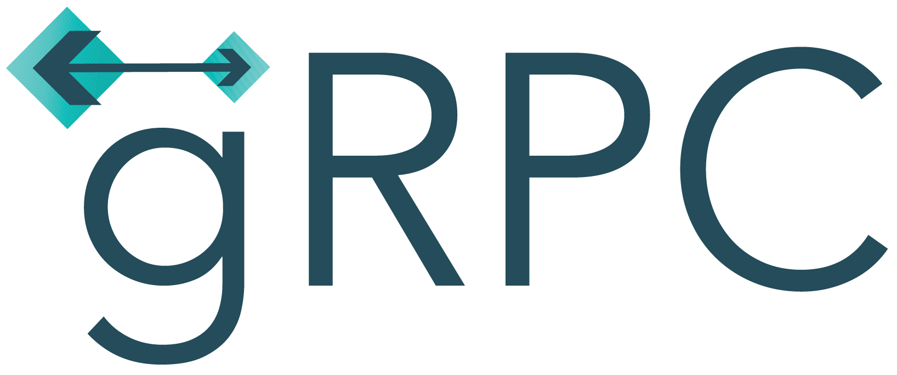

# dm_api_tests_pavels
### Проект API автотестов для локального приложения DM.

В ветке main - фреймворк, который включает в себя все вспомогательные библиотеки.  
В ветке client - фреймворк, из которого вынесены вспомогательные библиотеки.  
В ветке client_gen - фреймворк, где клиент account и login сгенерированы, а так же сгенерирован клиент из gRPC модели.  

### Используемые технологии

  <code></code>
  <code></code>
  <code></code>
  <code></code>
  <code></code>
  <code></code>
  <code></code>
  <code></code>
  <code></code>
  <code></code>

### В файле config настраиваются окружения и выносятся основные подключения.

###  Allure report
##### После прохождения тестов, результаты можно посмотреть в генерируемом Allure отчете.

##### Во вкладке Graphs можно посмотреть графики о прохождении тестов, по их приоритезации, по времени прохождения и др.

##### Во вкладке Suites находятся собранные тест кейсы, у которых описаны шаги и добавлены логи.

